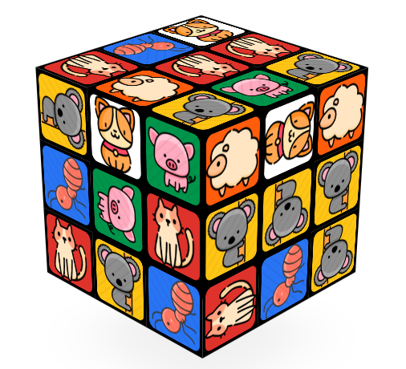

# zoo-3dcube

[简体中文](./README.md) | English

Cute pet 3D cube game

> Since the cute pet picture address is stored in GitHub, and the project is deployed on GitHub Pages, please ensure that the current network environment is smooth!

## 🔥 Preview


## ✨ Cute pet list

https://github.com/zoo-js/zoo

## 📦 How to use

### Online preview

https://zoo-js.github.io/3dcube/?red=cat&white=dog&blue=pig&green=sheep&orange=koala&yellow=ant&bg=*ffd8bf

### Project introduction

```html
<iframe
  id="zoo-3dcube"
  src="https://zoo-js.github.io/3dcube/?red=cat&white=dog&blue=pig&green=sheep&orange=koala&yellow=ant&bg=*ffd8bf"
  name="3dcube"
  width="100%"
  height="100%"
  scrolling="no"
  frameborder="0">
</iframe>
```

More about `iframe` view：https://developer.mozilla.org/en-US/docs/Web/HTML/Element/iframe

### Support

```js
red     // red noodles
white   // white noodles
blue    // blue noodles
green   // green noodles
orange  // orange noodles
yellow  // yellow noodles
bg      // background color
/*
  The background color supports direct English，like red or blue.
  Hex color values are also supported, such as #ffccc7 #ffd8bf #f4ffb8. Note `#` replaced with `*`.
*/
```

## 🎗 Tip

- The Rubik's Cube source code comes from the Internet
- Entertainment sharing only
